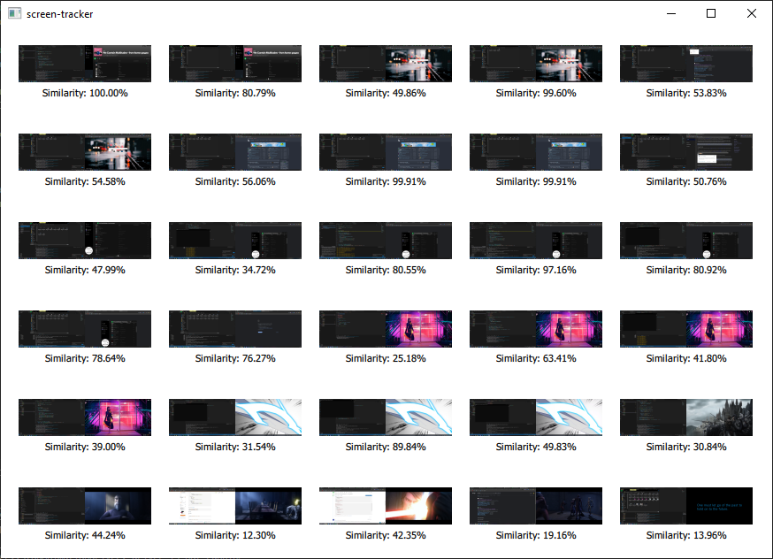

# screen-tracker

It is a program that takes screenshots of your monitors every minute and saves the similarity with the previous screenshot.



## Features
- **Statistics view**: you can view the image and similarity in the window;
- **Database**: the information are stored in a SQLite database.

## Building
Requirements:
- Compiler with C++20 support;
- [CMake 2.20+](https://cmake.org/);
- [Qt 5](https://www.qt.io/);
- [OpenCV](https://opencv.org/).

```bash
cmake . -B build
cmake --build build
```