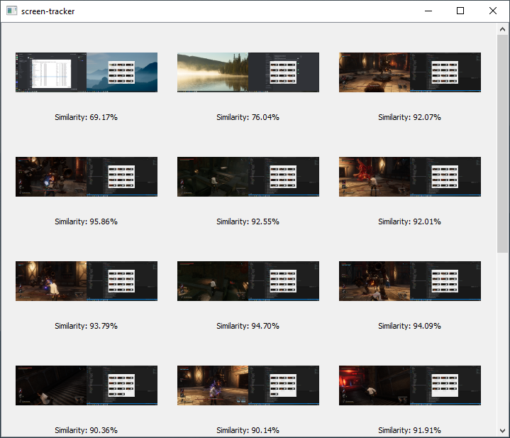

# screen-tracker

A program that screenshots your monitors every minute and saves the similarity to the previous screenshot.



## Features
- **Image list**: you can view the image and similarity in the window;
- **Database**: the information are stored in a SQLite database.

## Building
Requirements:
- Compiler with C++20 support;
- [CMake 3.22+](https://cmake.org/);
- [Qt 5](https://www.qt.io/);

```bash
cmake . -B build
cmake --build build
```